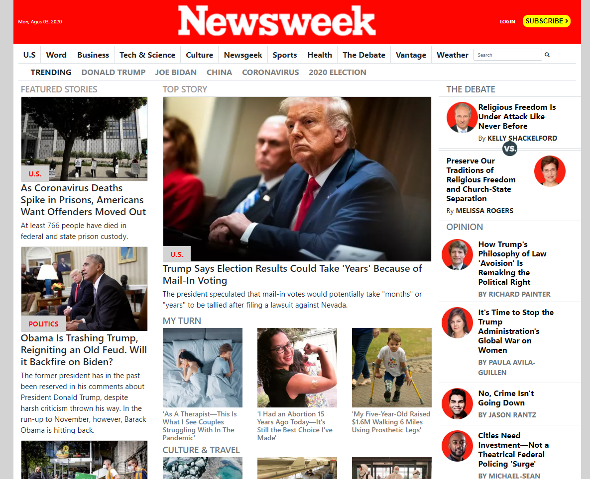

#  🧐 Newsweek-Clone

> This is the sixth collaborative project from Microverse program, It's a mock-up of a Newsweek web , it's built on HTML and CSS3 languages using frameworks in this case We use Bootstrap 4.

## 🔧 Built With

- HTML and CSS3.
- Using UX.
- Using floats and flexbox.
- Using framework Bootstrap.
- Using StyleLinters.
- W3 HTML Validation Service.

## 🔴 Live Demo

[Live Demo Link](https://rawcdn.githack.com/diazgio/Newsweek-Clone/tree/feature-branch)

## 🛠 Getting Started

To get a local copy up and running follow these simple example steps.

- Go to the main page of te repo.
- Press the "Code" button and get the repo link.
- Clone it using git.

## ✒️ Authors

👤 **Youcef ABDELLANI**

- Github: [@Youcef ABDELLANI](https://github.com/ABDELLANI-Youcef)
- Twitter: [@YoucefAbdellani](https://twitter.com/YoucefAbdellani)
- Linkedin: [linkedin](https://www.linkedin.com/in/youcef-abdellani-b79361124/)

👤 **Giordano Díaz**

- Github: [@diazgio](https://github.com/diazgio)
- Twitter: [@giordano_diaz](https://twitter.com/giordano_diaz)
- LinkenIn:[LinkenIn](www.linkedin.com/in/Giordano-Diaz)

## 🤝 Contributing

Contributions, issues and feature requests are welcome!

Feel free to check the [issues page](issues/).

## 📝 License

This project is [MIT](lic.url) licensed.